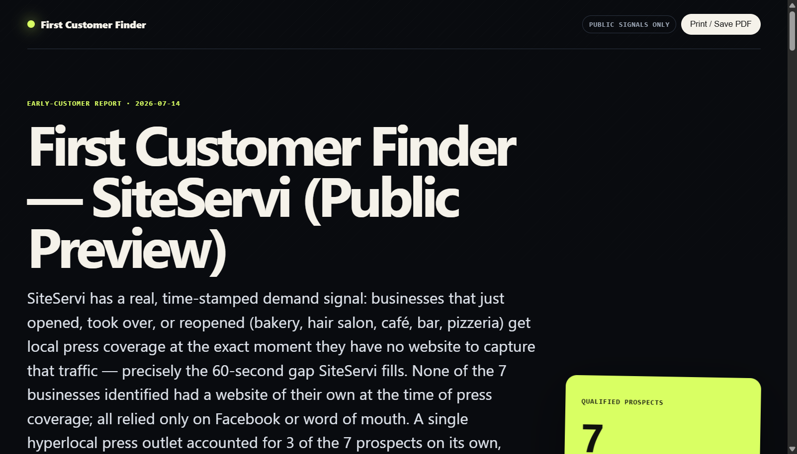

# First Customer Finder — Claude Code port



This is a **port to Claude Code** of the original [`codex-first-customer-finder-skill`](https://github.com/Kappaemme-git/codex-first-customer-finder-skill), a Codex skill created by **[Kappaemme](https://github.com/Kappaemme-git)**.

All credit for the skill's design, workflow, research framework, and report generator goes to the original author. This repository only adapts the skill so it can be installed and invoked inside [Claude Code](https://claude.com/claude-code).

- Original repository: https://github.com/Kappaemme-git/codex-first-customer-finder-skill
- Original author: [Kappaemme](https://github.com/Kappaemme-git) (Francesco Mistero)
- License: MIT (see [LICENSE](LICENSE)), copyright retained by the original author

## How it works (Comment ça marche)

For a beginner, three steps. You never paste this repository into the conversation.

1. **Install the skill once.** Clone the repository, then place the `first-customer-finder` folder in your skills directory.

   macOS, Linux, Git Bash:

   ```bash
   git clone https://github.com/RAAAAAGEEEEE/claude-first-customer-finder-skill
   mkdir -p ~/.claude/skills
   cp -r claude-first-customer-finder-skill/first-customer-finder ~/.claude/skills/first-customer-finder
   ```

   Windows PowerShell:

   ```powershell
   git clone https://github.com/RAAAAAGEEEEE/claude-first-customer-finder-skill
   New-Item -ItemType Directory -Force "$HOME\.claude\skills" | Out-Null
   Copy-Item -Recurse claude-first-customer-finder-skill\first-customer-finder "$HOME\.claude\skills\first-customer-finder"
   ```

   This is the personal install (every project). For one project only, copy the same folder to `.claude/skills/first-customer-finder` inside that project. Details: [docs/INSTALLATION.md](docs/INSTALLATION.md).
2. **Ask for it.** In a Claude Code session, write in plain language, for example "find first customers for https://example.com", or type `/first-customer-finder`.
3. **Read the report.** Claude researches public sources, scores prospects, drafts openers without sending anything, and gives you a link to an HTML report.

A skill is a folder containing a `SKILL.md` file. Claude Code loads it by itself when your request matches its `description`, and `/<name>` launches it by hand.

## The problem and who it is for

Early-stage founders often do not know where to find their first users. This skill turns a product URL or description into a short list of prospects, each backed by a cited public signal. It is aimed at solo founders and small teams doing manual, low-volume customer discovery.

## Status

Working port, checked only by the manual smoke test in [docs/USAGE.md](docs/USAGE.md#verify-the-report-generator). There is no automated test suite and the skill has no version number of its own. Research quality depends on what Claude can reach on the public web.

## Prerequisites

- Claude Code with web access (search and page fetch).
- Python 3 on your PATH, standard library only (the report generator was run with Python 3.11).
- Git, to clone the repository.

## What the skill does

Turns a startup URL or product description into a short, evidence-backed list of plausible first customers, sourced from public pain and buying signals (forums, reviews, public posts, company pages, etc.), and produces a standalone HTML report. It never sends outreach automatically — it only drafts it.

See [`first-customer-finder/SKILL.md`](first-customer-finder/SKILL.md) for the full workflow, modes, and quality bar.

## Changes made for this port

Only 3 changes were made relative to the original Codex skill — everything else (workflow, scoring framework, JSON schema, HTML report generator) is unchanged:

1. `first-customer-finder/SKILL.md` — frontmatter `description`: replaced "Codex" with "Claude Code" so the skill triggers correctly in Claude Code's skill index.
2. `first-customer-finder/SKILL.md` — step 6.5 of the workflow: "so it opens from Codex" → "so it opens from Claude Code".
3. `first-customer-finder/references/report-artifact.md` — "Return a clickable absolute file link in Codex" → "in Claude Code", fixing a reference left over from the original that the upstream port to Claude Code had missed.

No behavioral, structural, or scoring logic was changed. `scripts/generate_report.py` and `references/research-framework.md` are copied byte-for-byte from the original.

## Install for Claude Code

See [How it works](#how-it-works-comment-ça-marche) above for the commands and [docs/INSTALLATION.md](docs/INSTALLATION.md) for verification and updates.

## Usage

Ask Claude Code to run the skill against a product URL or description, optionally specifying a mode:

```
Use the skill first-customer-finder in standard mode to find first customers for https://example.com
```

Available modes: `quick` (up to 5 prospects), `standard` (default, up to 10), `deep` (up to 20), `design-partners`, `b2b`, `community`.

The skill will research public signals, qualify and score prospects, and generate a standalone HTML report under `outputs/` in your workspace, with a clickable link returned in the chat.

## Minimal example

Prompt:

```
Use the skill first-customer-finder in quick mode to find first customers for https://example.com
```

Output: a standalone HTML report like the anonymized preview image at the top of this page. Report structure: [docs/USAGE.md](docs/USAGE.md).

## Architecture in short

`SKILL.md` holds the workflow. Two reference files give the research framework and the report JSON schema. `scripts/generate_report.py` turns that JSON into HTML. Detail: [docs/ARCHITECTURE.md](docs/ARCHITECTURE.md).

## Configuration

No configuration file and no environment variable. The only choices are the mode and the product input. See [docs/CONFIGURATION.md](docs/CONFIGURATION.md).

## Security and privacy

Public web sources only. The skill never sends messages, submits forms, follows or comments. Words from your product description can appear in web search queries. See [docs/PRIVACY_AND_SECURITY.md](docs/PRIVACY_AND_SECURITY.md).

## Limitations

Prospects are research hypotheses, not confirmed buyers; results depend on live web access and are not reproducible. See [docs/LIMITATIONS.md](docs/LIMITATIONS.md).

## Roadmap

Non-binding, nothing is promised. Possible work: an automated test for the report generator, and a version number for the skill.

## Contributing

See [CONTRIBUTING.md](CONTRIBUTING.md). Changes are listed in [CHANGELOG.md](CHANGELOG.md).

## Documentation

- [Installation](docs/INSTALLATION.md)
- [Usage](docs/USAGE.md)
- [Configuration](docs/CONFIGURATION.md)
- [Architecture](docs/ARCHITECTURE.md)
- [Troubleshooting](docs/TROUBLESHOOTING.md)
- [Limitations](docs/LIMITATIONS.md)
- [Privacy and security](docs/PRIVACY_AND_SECURITY.md)
- [Legal and attribution](docs/LEGAL_AND_ATTRIBUTION.md)

## License

MIT — see [LICENSE](LICENSE). Copyright belongs to the original author, Francesco Mistero ([Kappaemme](https://github.com/Kappaemme-git)). This port does not claim authorship of the underlying skill design.
